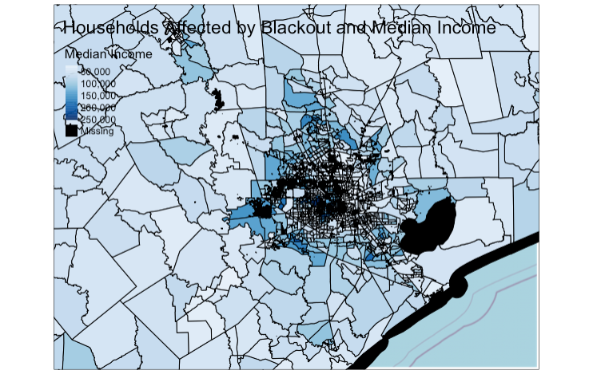

```{r setup, include=FALSE, message=FALSE, warning=FALSE}
knitr::opts_chunk$set(echo = TRUE, message = FALSE, warning = FALSE, include = TRUE)
```

# The Analysis
In this assignment for our Spatial Analysis class, we use remotely-sensed light data from NASA's Worldview to identify residences in the Houston metropolitan area that lost power during the major blackout in February 2021. The goal of the analysis is to:

1) Estimate how many residential buildings were without power on 2021/02/16?
2) Is there a socioeconomic metric that predicts being affected by the power outage?

The data was specifically acquired from the Visible Infrared Imaging Radiometer Suite (VIIRS) on the Suomi satellite. Using highways data from Open Street Map, residences within 200 meters of a major highway were excluded. Residence building count was  based on Open Street Map's buildings data. Lastly, a few socioeconomic indicators from census data is explored for correlations with likelihood of being impacted by the blackout.

## Load Libraries
```{r}
library(sf)
library(stars)
library(tidyverse)
library(raster)
library(tmap)
library(rosm)
library(patchwork)
```

## Function to Load the DNB Dataset from VNP46A1 Granules
```{r}
read_dnb <- function(file_name) {
  # Reads the "DNB_At_Sensor_Radiance_500m" dataset from a VNP46A1 granule into a STARS object.
  # Then read the sinolsoidal tile x/y positions and adjust the STARS dimensions (extent+delta)

  # The name of the dataset holding the nightlight band in the granule
  dataset_name <- "//HDFEOS/GRIDS/VNP_Grid_DNB/Data_Fields/DNB_At_Sensor_Radiance_500m"

  # From the metadata, we pull out a string containing the horizontal and vertical tile index
  h_string <- gdal_metadata(file_name)[199]
  v_string <- gdal_metadata(file_name)[219]
  
  # We parse the h/v string to pull out the integer number of h and v
  tile_h <- as.integer(str_split(h_string, "=", simplify = TRUE)[[2]])
  tile_v <- as.integer(str_split(v_string, "=", simplify = TRUE)[[2]])

  # From the h/v tile grid position, we get the offset and the extent
  west <- (10 * tile_h) - 180
  north <- 90 - (10 * tile_v)
  east <- west + 10
  south <- north - 10

  # A tile is 10 degrees and has 2400x2400 grid cells
  delta <- 10 / 2400

  # Reading the dataset
  dnb <- read_stars(file_name, sub = dataset_name)

  # Setting the CRS and applying offsets and deltas
  st_crs(dnb) <- st_crs(4326)
  st_dimensions(dnb)$x$delta <- delta
  st_dimensions(dnb)$x$offset <- west
  st_dimensions(dnb)$y$delta <- -delta
  st_dimensions(dnb)$y$offset <- north
  
  return(dnb)
}
```

## Load in the Satellite Data: tilenumber_mm_dd

Next we load the four tiles that give us a complete image of Houston on 
2021-02-07 and 2021-02-16. We save the tiles under the naming convention `tilenumber_mm_dd`.

```{r}
file_name <- "data/VNP46A1/VNP46A1.A2021038.h08v05.001.2021039064328.h5"
t05_02_07 <- read_dnb(file_name = file_name)

file_name <- "data/VNP46A1/VNP46A1.A2021038.h08v06.001.2021039064329.h5"
t06_02_07 <- read_dnb(file_name = file_name)

file_name <- "data/VNP46A1/VNP46A1.A2021047.h08v05.001.2021048091106.h5"
t05_02_16 <- read_dnb(file_name = file_name)

file_name <- "data/VNP46A1/VNP46A1.A2021047.h08v06.001.2021048091105.h5"
t06_02_16 <- read_dnb(file_name = file_name)
```

### Combine Tiles by Day

`st_mosaic()` is used to combine the tiles for each day to provide a complete picture of Houston on each day, then we use `rm()` to clear the large original tiles.

```{r}
combined_02_07 <- st_mosaic(t05_02_07, t06_02_07)

combined_02_16 <- st_mosaic(t05_02_16, t06_02_16)

rm(t05_02_07, t06_02_07, t05_02_16, t06_02_16)
gc()

```

### Create a Blackout Mask

To create a blackout mask, we identify cells where the difference in DNB between 2021-02-07 and 2021-02-16 is greater than 200 nW cm^-2 sr^-1. Where the difference is less than this threshold, we assign a value of NA. 

```{r}
difference_mask <- (combined_02_07 - combined_02_16) > 200

difference_mask[difference_mask == FALSE] <- NA

rm(combined_02_07,combined_02_16)
gc()
```

### Vectorize the Blackout Mask

We use `st_as_sf()` to vectorize the blackout mask and then `st_make_valid()` to repair the geometries of some of the polygons in the resulting vectorized mask.

```{r}
difference_mask <- st_as_sf(difference_mask)

difference_mask <- st_make_valid(difference_mask)
```

### Crop the Vectorized Mask with the Region of Interest (ROI)

We create a bounding box of the Houston metropolitan area and then give it a CRS of WGS 84 (for the time being).

```{r}
roi = st_polygon(list(rbind(c(-96.5, 29), 
                            c(-96.5, 30.5), 
                            c(-94.5, 30.5), 
                            c(-94.5, 29), 
                            c(-96.5, 29))))

# plot(roi)

roi <- st_sfc(roi, crs = 4326)
```

### Spatial Subsetting

Using our bounding box, we create a cropped difference mask by keeping only the values of the cells that intersect the bounding box, then we use `st_transform()` to give the cropped data a projected CRS of NAD83/Texas Centric Albers.

```{r}
intersects <- st_intersects(difference_mask, roi, sparse = FALSE)
cropped = difference_mask[intersects,]

crs = st_crs(3083)
cropped = st_transform(cropped, crs)

rm(difference_mask)
gc()
```

## Read in and Process the Roads Data

### Function to Load the Doads Data from OpenStreetMap

We use the SQL query provided to us from the class to read in the data where the column `fclass` is "motorway" in the OSM roads dataset.

```{r}
query_r <- "SELECT * FROM gis_osm_roads_free_1 WHERE fclass='motorway'"
highways <- st_read("data/gis_osm_roads_free_1.gpkg", query = query_r)
```

### Buffer the roads

Next, we use `st_transform()` to reproject the data to NAD83/Texas Centric Albers, then create a buffer of 200 m around the highways.

```{r}
#st_crs(highways)

highways = st_transform(highways, crs)

highways_buffered = st_union(st_buffer(highways, dist = 200))

rm(highways)
gc()
```

## Read in and Process the Buildings Data

### Function to Load the Buildings Data from OpenStreetMap

We use the SQL query provided to us in homework 2 to identify and read in the data where the type is NULL and name is NULL, or where the type is "residential", "apartments", "house", "static_caravan", or "detached" from the OSM buildings dataset to acquire data of residences in the Houston area.

```{r}
query_b <- "SELECT * 
FROM gis_osm_buildings_a_free_1
WHERE (type IS NULL AND name IS NULL)
OR type in ('residential', 'apartments', 'house', 'static_caravan', 'detached')"

residences <- st_read("data/gis_osm_buildings_a_free_1.gpkg", query = query_b)
```

### Reprojecting the Residences Data

Then, we use `st_transform()` to reproject the residences data in NAD83/Texas Centric Albers.

```{r}
residences = st_transform(residences, crs)

#st_crs(residences)
```

## Read in the Census tract data

We explore the available census data, then read in the census tract geometries data, as well as income data. We reproject the census tract geometries to NAD83/Texas Centric Albers, and subset the income data to keep the median income data.

```{r}
# st_layers("data/ACS_2019_5YR_TRACT_48_TEXAS.gdb")

acs_geoms <- st_read("data/ACS_2019_5YR_TRACT_48_TEXAS.gdb",
                     layer = "ACS_2019_5YR_TRACT_48_TEXAS")
acs_geoms = st_transform(acs_geoms, crs)

acs_income <- st_read("data/ACS_2019_5YR_TRACT_48_TEXAS.gdb",
                      layer = "X19_INCOME")

median_income <- acs_income[c("GEOID", "B19013e1")]

rm(acs_income)
gc()
```

## Merge the Datasets

### Merge the Night Lights Data, the Buffered Highways, and the Residences

We remove the buffered highways from the blacked out night lights data using `st_difference()`, then use `st_intersects` to find buildings within the blacked out night lights data that were affected by the blackout.

```{r}
cropped_no_highways <- st_difference(cropped, highways_buffered)

affected_buildings <- residences[cropped_no_highways, op = st_intersects]
```

### Merge the census tract geometries with the census income data

We use a left join to merge the census data with the census tract geometries, using their shared information in the columns `GEOID_Data` and `GEOID`.

```{r}
acs_geom_income <- dplyr::left_join(acs_geoms, median_income, by = c("GEOID_Data" = "GEOID"))

rm(acs_geoms)
gc()
```

## Question 1: How many residential buildings were without power on 2021-02-16?

- The number of residential buildings that were without power on 2021-02-16 is `r nrow(affected_buildings)`

## Question 2: Is there a socioeconomic metric that predicts being affected by the power outage?

First we map median income by census tracts with residences affected by the blackout:

```{r}
#Bounding box and basemap
houston_bb <- st_bbox(roi)
houston_map <- osm.raster(houston_bb)

# tmap::tmap_mode(mode = "plot")
# 
# #Creating the map
# tm_shape(houston_map) +
#   tm_rgb() +
#   tm_shape(acs_geom_income,
#            bbox = houston_bb) +
#   tm_polygons(col = "B19013e1",
#               title = "Median Income",
#               colorNA = "black",
#               style = "cont",
#               palette = "Blues") +
#   tm_shape(affected_buildings,
#            bbox = houston_bb) +
#   tm_polygons() + tm_style("col_blind") +
#   tm_layout(title = "Households Affected by Blackout and Median Income")
```

Note: the figure above was originally designed to be interactive but this was changed for this post due to excessive load times.

**Figure 1.** Exploratory map showing median household income by census tract (dark blue = high income), overlaid with locations of residences that lost power during the February blackout. Data is from Open Street Map and NASA's Worldview.

That looks interesting but it's hard to identify patterns. It does appear thata large cluster of homes in two census tracts in western Houston lost power. This is a extreme concentration of homes that lost power compared to other areas.Now we make a histogram of median income for all households in the Houston metropolitan area to compare with a histogram of median income for households impacted by the blackout:

- First, spatially join the residences data with the median income data:

```{r}
residences_income <- st_join(residences, acs_geom_income, join = st_intersects)
```

- Then, subset the resulting dataset to only include residences affected by the blackout:

```{r}
impacted_residences_income <- residences_income[cropped_no_highways, op = st_intersects]
```

- Finally, build the two histograms and display them side-by-side using `patchwork`:

```{r}
#All residences
histogram_residences_income <- ggplot(residences_income) +
  geom_histogram(aes(x = residences_income$B19013e1), bins = 100, fill = "darkblue") +
  labs(title = "All Houston Residences",
       x = "Median Household Income",
       y = "Count") +
  theme_minimal() +
  scale_y_discrete(limits = c(5000,10000,15000,20000)) +
  ylim(c(0, 20000))

#Impacted residences
histogram_impacted_income <- ggplot(impacted_residences_income) +
  geom_histogram(aes(x = impacted_residences_income$B19013e1), bins = 100, fill = "darkblue") +
  labs(title = "Impacted Houston Residences",
       x = "Median Household Income",
       y = "Count") +
  theme_minimal() +
  scale_y_discrete(limits = c(5000,10000,15000,20000)) +
  ylim(c(0, 20000))

histogram_residences_income + histogram_impacted_income
```

**Figure 2.** Histogram showing the number of homes by census tract median household income in the Houston metropolitan area (left) and the number of homes impacted during the blackout by census tract median household income (right). Data is from Open Street Map and NASA's Worldview.

The impacted residences histogram shows relatively fewer low income households impacted compared to the density of low income households in the total area. Though the number of impacted high income households is lower than the total high income households, it appears to be relatively higher than impacted low income households. Interestingly, income may be positively correlated with likelihood of being impacted. However,this could be due to the aforementioned census tract areas where a large percent of houses lost power.

## Conclusions

More than 150,000 residences lost power during the February blackout in the Houston area alone. This is likely an underestimate, as residences may have been excluded due to our highways buffer, interference in the satellite from clouds or other atmospheric differences, or due to our exclusion of cells where the difference was not greater than 200 nW cm^-2 sr^-1. The socioeconomic factor that we examined, median income, is not clearly correlated with likelihood of being impacted by the blackout, though there may be a slight positive correlation between income and likelihood. We also explored census race data for white only households but there was no obvious correlation between a household being white and likelihood of losing power. The race data exploration and download code was removed from this document so that the markdown was more streamlined and did not overburden the computers.However, other socioeconomic factors that we did not examine may have been more strongly correlated. 
