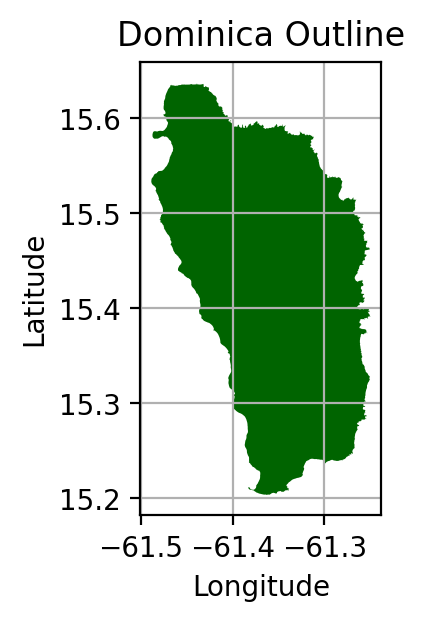
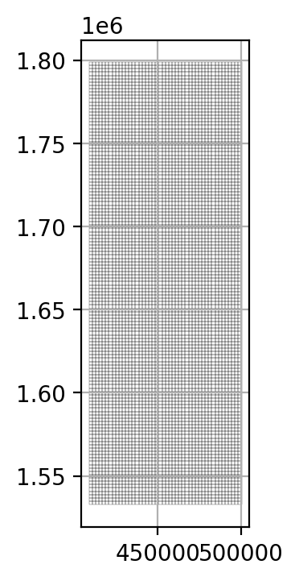
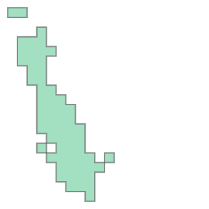
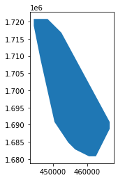

```{css include = F}
.scrollit {
    overflow:scroll;
    height:250px;
  }
```

## Introduction

The goal of this assignment was to create a method to determine the outline of a speed reduction zone and its effect on the local marine traffic for Dominica. The speed reduction zone encompasses the preferred habitat of the local sperm whales. This area was approximated as areas of frequent whale sightings off the coast.


```python
# libraries for the assignment:
import pandas as pd
import geopandas as gpd
import matplotlib.pyplot as plt
import numpy as np
from shapely.geometry import Polygon
```

## Dominica outline

We downloaded the country outline into the notebook.


```python
fp = "data/dominica/dma_admn_adm0_py_s1_dominode_v2.shp"

dom_outline = gpd.read_file(fp)

dom_outline = dom_outline.to_crs("EPSG:4602")
```

We plot the outline for exploration. 


```python
fig, ax = plt.subplots(figsize=(3, 3), dpi = 200)
ax.grid(True)
dom_outline.plot(ax = ax, 
                 color = "darkgreen")

ax.set_title("Dominica Outline")
ax.set_xlabel("Longitude")
ax.set_ylabel("Latitude")
```


    Text(94.618846252753, 0.5, 'Latitude')


    

    


## Whale sighting data

First, we read in the data and projected it into an appropriate CRS.


```python
fp_whales = "data/sightings2005_2018.csv"

whales = gpd.read_file(fp_whales)

geometry = gpd.points_from_xy(whales.Long, whales.Lat, crs = "EPSG:4326")
whales_geom = whales.set_geometry(geometry)
```

Next we convert the geometries from degrees to meters.


```python
whales_geom = whales_geom.to_crs("EPSG:2002")

dom_outline = dom_outline.to_crs("EPSG:2002")
```

### Create a sampling grid

Making the point observations into a habitat region.


```python
xmin, ymin, xmax, ymax = whales_geom.total_bounds

length = 2000
wide = 2000

cols = list(np.arange(xmin, xmax + wide, wide))
rows = list(np.arange(ymin, ymax + length, length))

polygons = []
for x in cols[:-1]:
    for y in rows[:-1]:
        polygons.append(Polygon([(x,y), (x+wide, y), (x+wide, y+length), (x, y+length)]))
        
grid = gpd.GeoDataFrame({'geometry':polygons})
grid.to_file("grid.shp")
```


```python
fp_grid = "grid.shp"

grid = gpd.read_file(fp_grid)
grid = grid.set_crs("EPSG:2002")
grid = grid.to_crs("EPSG:2002")
```

Plotting the grid to make sure it looks how we expected.


```python
fig, ax = plt.subplots(figsize=(4, 4), dpi=200)
ax.grid(True)

grid.plot(ax = ax, 
          facecolor = "none", 
          lw = 0.1)
```


    <AxesSubplot:>


    

    


## Extract the whale habitat
Now we spatially joined the grid we made in the previous step with our sighting data to count the number of sightings in each cell.


```python
grid_join = grid.sjoin(whales_geom, how = "inner")
```


```python
grid['count'] = grid_join.groupby(grid_join.index).count()['index_right']
```


```python
grid = grid.loc[(grid['count'] > 20)]
```

## Create a convex hull
We used `unary_union` to create a Multipolygon containing the union of all geometries in the GeoSeries


```python
speed_zone = grid.unary_union
speed_zone
```


    

    


```python
speed_zone = gpd.GeoSeries(speed_zone)
speed_zone = speed_zone.convex_hull
speed_zone.plot()
```


    <AxesSubplot:>


    

    


The plot above is now our habitat zone. Next we added it to the Dominica outline.


```python
speed_zone = gpd.GeoDataFrame({'geometry':speed_zone}, crs = 2002)
```


```python
fig, ax = plt.subplots(figsize = (10,10), dpi = 200)
dom_outline.plot(ax = ax, 
                 color = "darkgreen")
speed_zone.plot(ax = ax, 
                color = "lightyellow", 
                edgecolor = "black", 
               alpha = 0.5)
ax.set_title("Dominica Outline and Sperm Whale Habitat")
ax.set_xlabel("Longitude")
ax.set_ylabel("Latitude")
```


    Text(364.48357887628714, 0.5, 'Latitude')


    

    


There is some overlap from the outline of Dominica and the habitat but that is fine for our calculations. Next we will upload the vessel data.

## Vessel Data
Using the Automatic Identification System (AIS) we loaded the vessel data.


```python
fp_vessels = "data/station1249.csv"

vessels = gpd.read_file(fp_vessels)

geometry = gpd.points_from_xy(vessels.LON, vessels.LAT, crs = "EPSG:4326")
vessels_geom = vessels.set_geometry(geometry)
```


```python
vessels_geom = vessels_geom.to_crs("EPSG:2002")
```

Next we explored the datatypes to make sure they are what we expected.


```python
print(vessels_geom.dtypes)
```

    field_1        object
    MMSI           object
    LON            object
    LAT            object
    TIMESTAMP      object
    geometry     geometry
    dtype: object


The 'TIMESTAMP' data is not in datetime formatting so we changed it.


```python
vessels_geom['TIMESTAMP'] = pd.to_datetime(vessels_geom['TIMESTAMP'], format = '%Y-%m-%d %H:%M:%S')
```


```python
print(vessels_geom.dtypes)
```

    field_1              object
    MMSI                 object
    LON                  object
    LAT                  object
    TIMESTAMP    datetime64[ns]
    geometry           geometry
    dtype: object


## Setting up to calcute speed and distance

A few things needed to be done to make the necessary calculations:
1) Spatially subset vessel tracks within whale habitat
2) Sort the dataframe by MMSI and TIMESTAMP
3) Create a copy of the dataframe and shift each observation down one row using shift() and then join with the original dataset
4) Drop all rows in the joined dataframe in which the MMSI of the left is not the same as the one on the right.
5) Set the geometry column with the set_geometry() function


```python
# 1) spatial subsetting
vessels_geom = vessels_geom.sjoin(speed_zone, how = "inner")
```


```python
# 2) sorted the df by MMSI and TIMESTAMP
vessels_geom = vessels_geom.sort_values(by = ["MMSI", "TIMESTAMP"])
```


```python
# 3) created a copy of our df and shifted down a row then joined back with original dataset
vs_geom_copy = vessels_geom.shift(1)

# joined back with original dataset
vessels_joined = vs_geom_copy.join(vessels_geom,
                                   how = "left",
                                  lsuffix = 'start',
                                  rsuffix = 'end')
```


```python
# 4) Dropped rows where the MMSI did not match
vessels_joined_filt = vessels_joined[vessels_joined["MMSIstart"] == vessels_joined["MMSIend"]]
```


```python
# 5) Set the geometry column
vessels_joined_filt = vessels_joined_filt.set_geometry("geometrystart")
```

## Calculations
1) The distance for each observation to the next
2) The time difference between each observation to the next
3) The average speed between each observation to the next
4) The time that the distance would have taken at 10 knots.
5) The difference between the time that it actually took and how much it would have taken at 10 knots.
6) Finally, sum up the extra time the 10 knots zone would have taken for all ships!


```python
# 1) Distance between observations
vessels_joined_filt['distance'] = vessels_joined_filt['geometrystart'].distance(vessels_joined_filt['geometryend'])
```


```python
# 2) Time difference between observations
vessels_joined_filt['time_diff'] = vessels_joined_filt['TIMESTAMPend'] - vessels_joined_filt['TIMESTAMPstart']
```


```python
# 3) The average speed between each observation
vessels_joined_filt['avg_speed_m_s'] = vessels_joined_filt['distance']/vessels_joined_filt['time_diff'].dt.total_seconds()
```


```python
# 4) Time that the distance would have taken at 10 knots.
# 10 knot = 5.1444 m/s
kts_10 = 5.1444
vessels_joined_filt['time_10kts_tot_s'] = (vessels_joined_filt['distance'] / kts_10)
```


```python
# 5) Difference between the time that it actually took and time it would have taken at 10 knots
vessels_joined_filt['time_10kts_diff_hr'] = (vessels_joined_filt['time_10kts_tot_s'] - vessels_joined_filt['time_diff'].dt.total_seconds()) / (60 *60)

# Below is what the head() of the data looks like after adding the columns from these calculations
vessels_joined_filt.head()
```


<div>
<style scoped>
    .dataframe tbody tr th:only-of-type {
        vertical-align: middle;
    }

    .dataframe tbody tr th {
        vertical-align: top;
    }

    .dataframe thead th {
        text-align: right;
    }
</style>
<table border="1" class="dataframe">
  <thead>
    <tr style="text-align: right;">
      <th></th>
      <th>field_1start</th>
      <th>MMSIstart</th>
      <th>LONstart</th>
      <th>LATstart</th>
      <th>TIMESTAMPstart</th>
      <th>geometrystart</th>
      <th>index_rightstart</th>
      <th>field_1end</th>
      <th>MMSIend</th>
      <th>LONend</th>
      <th>LATend</th>
      <th>TIMESTAMPend</th>
      <th>geometryend</th>
      <th>index_rightend</th>
      <th>distance</th>
      <th>time_diff</th>
      <th>avg_speed_m_s</th>
      <th>time_10kts_tot_s</th>
      <th>time_10kts_diff_hr</th>
    </tr>
  </thead>
  <tbody>
    <tr>
      <th>235018</th>
      <td>235025</td>
      <td>203106200</td>
      <td>-61.40929</td>
      <td>15.21021</td>
      <td>2015-02-25 15:32:20</td>
      <td>POINT (462476.396 1680935.224)</td>
      <td>0.0</td>
      <td>235018</td>
      <td>203106200</td>
      <td>-61.41107</td>
      <td>15.21436</td>
      <td>2015-02-25 15:34:50</td>
      <td>POINT (462283.995 1681393.698)</td>
      <td>0</td>
      <td>497.209041</td>
      <td>0 days 00:02:30</td>
      <td>3.314727</td>
      <td>96.650541</td>
      <td>-0.014819</td>
    </tr>
    <tr>
      <th>235000</th>
      <td>235018</td>
      <td>203106200</td>
      <td>-61.41107</td>
      <td>15.21436</td>
      <td>2015-02-25 15:34:50</td>
      <td>POINT (462283.995 1681393.698)</td>
      <td>0.0</td>
      <td>235000</td>
      <td>203106200</td>
      <td>-61.41427</td>
      <td>15.22638</td>
      <td>2015-02-25 15:42:19</td>
      <td>POINT (461936.769 1682722.187)</td>
      <td>0</td>
      <td>1373.116137</td>
      <td>0 days 00:07:29</td>
      <td>3.058165</td>
      <td>266.914730</td>
      <td>-0.050579</td>
    </tr>
    <tr>
      <th>234989</th>
      <td>235000</td>
      <td>203106200</td>
      <td>-61.41427</td>
      <td>15.22638</td>
      <td>2015-02-25 15:42:19</td>
      <td>POINT (461936.769 1682722.187)</td>
      <td>0.0</td>
      <td>234989</td>
      <td>203106200</td>
      <td>-61.41553</td>
      <td>15.2353</td>
      <td>2015-02-25 15:47:19</td>
      <td>POINT (461798.818 1683708.377)</td>
      <td>0</td>
      <td>995.792381</td>
      <td>0 days 00:05:00</td>
      <td>3.319308</td>
      <td>193.568226</td>
      <td>-0.029564</td>
    </tr>
    <tr>
      <th>234984</th>
      <td>234989</td>
      <td>203106200</td>
      <td>-61.41553</td>
      <td>15.2353</td>
      <td>2015-02-25 15:47:19</td>
      <td>POINT (461798.818 1683708.377)</td>
      <td>0.0</td>
      <td>234984</td>
      <td>203106200</td>
      <td>-61.41687</td>
      <td>15.23792</td>
      <td>2015-02-25 15:49:50</td>
      <td>POINT (461654.150 1683997.765)</td>
      <td>0</td>
      <td>323.533223</td>
      <td>0 days 00:02:31</td>
      <td>2.142604</td>
      <td>62.890371</td>
      <td>-0.024475</td>
    </tr>
    <tr>
      <th>234972</th>
      <td>234984</td>
      <td>203106200</td>
      <td>-61.41687</td>
      <td>15.23792</td>
      <td>2015-02-25 15:49:50</td>
      <td>POINT (461654.150 1683997.765)</td>
      <td>0.0</td>
      <td>234972</td>
      <td>203106200</td>
      <td>-61.41851</td>
      <td>15.24147</td>
      <td>2015-02-25 15:54:49</td>
      <td>POINT (461476.997 1684389.925)</td>
      <td>0</td>
      <td>430.317090</td>
      <td>0 days 00:04:59</td>
      <td>1.439188</td>
      <td>83.647673</td>
      <td>-0.059820</td>
    </tr>
  </tbody>
</table>
</div>


```python
# 6) Final calculation
increased_time = vessels_joined_filt[vessels_joined_filt['time_10kts_diff_hr'] > 0] 
print("The increased travel time for the ship traffic is ", 
      round((increased_time['time_10kts_diff_hr'].sum())/24, 2),
     " days.")
```

    The increased travel time for the ship traffic is  27.88  days.


